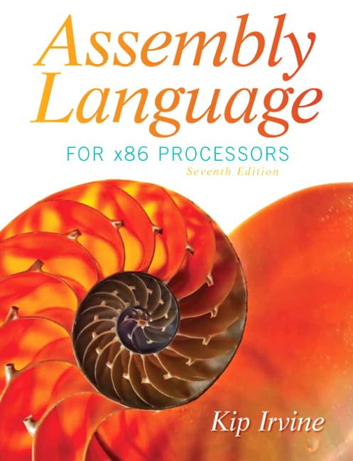

### Course summary

This course covers the organization and behavior of real computer systems at the assembly-language level. Topics include the mapping of statements and constructs in a high-level language onto sequences of machine instructions, as well as the internal representation of simple data types and structures. Numerical computation and subroutines are examined.

### Course Goals

You will gain the following knowledge in topics related to assembly language:

-   Intel and AMD processor architecture and programming.
-   Describe von Neumann architecture and how its components interact.
-   Real-address mode and protected mode programming.
-   Assembly language directives, macros, operators, and program structure.
-   Demonstrate how fundamental high-level programming constructs are implemented at the machine-language level.
-   Understand the Assembly Language's procedures, parameter passing and stack operations.
-   Programming methodology, showing how to use assembly language to create system-level software tools and application programs.
-   Diagnosing and debugging assembly language programs.

### Textbooks

::: grid
```{=html}
<!-- 
::: {.g-col-3}
{fig-align="left" width="80"}
:::

::: {.g-col-9}
- *Assembly Language Step-by-Step: Programming with Linux*
- by **Jeff Duntermann** 
- Wiley 2009, 3rd Edition.
::: -->
```
::: g-col-3
{fig-align="left" width="80"}
:::

::: g-col-9
-   *Assembly Language for x86 Processors*
-   by **Kip Irvine**
-   Pearson 2019, 8th Edition
:::
:::

### Lab Resources

It is quite important to try all examples in the lecture notes. You have two options:

1.  Use online compilers (Quick and easy):

    -   [OneCompiler.com](https://onecompiler.com/assembly)

2.  See Lab(1)

### Grading

| Activity   | Weight |
|------------|--------|
| Labs       | 40%    |
| Final Exam | 60%    |

### Tentative Schedule

| Week \# | Topic          | Kip    | Assignment |     |
|---------|----------------|--------|------------|-----|
| Week 1  | Basic Concepts | Ch.1-2 |            |     |
| Week 2  | Assembly Language Fundamentals | Ch.3-4 | Lab(1)  |     |
