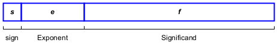
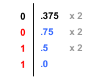

## Data Representation

### Integer Representations

-   Review the following representations:
    -   Binary integers
        -   Unsigned binary integers:
            -   Translating unsigned binary integer to decimal
            -   Translating unsigned decimal to binary
        -   Signed binary integers:
            -   1's complement representation
            -   2's complement representation
    -   Hexadecimal integers
        -   Hexadecimal 2's complement
        -   Translating binary integer to hexadecimal and vice versa.
        -   Translating hexadecimal integer to decimal and vice versa.

::: callout-note
## Example

1.  **Convert the following number** $(1100101)_2$ **to decimal**.

    \begin{align*}
         1100101_2 &= 1\times2^0 + 0\times2^1 + 1\times2^2 + 0\times2^3 + 0\times2^4 + 1\times2^5 + 1\times2^6 \\
         &= 1+4+32+64=101_{10}
     \end{align*}

2.  **Convert the following number** $(A13)_{16}$ **to decimal**.

    \begin{align*}
         A13_{16} &= 3\times16^0 + 1\times16^1 + 10\times16^2 \\
         &= 3 + 16 + 2560 = 2579_{10}
    \end{align*}

3.  **Convert the following number** $-14_{10}$ **to one-word binary**.

    In this course, one-word means 16 bits or two bytes.

    \begin{align*}
         14_{10} = 8 + 4 + 2 = 1110_2 &= 0000\; 0000\; 0000\; 1110_2 \\
         Neg &= 1111\; 1111\; 1111\; 0001_2 \\
         +1 &= 1111\; 1111\; 1111\; 0010_2
     \end{align*}

    $\therefore -14_{10} = 1111\;1111\;1111\;0010_2$

4.  **Convert the following number** $-14_{10}$ **to one-word hexadecimal**

    $-14_{10} = 1111\;1111\;1111\;0010_2$

    Since $1111_2$ = $\text{F}_{16}$ and $0010_2$ = $2_{16}$, then we have:

    $-14_{10}$ = FFF2~16~
:::

-   **Binary-Coded Decimal (BCD) Numbers**:

    -   In BCD, every decimal digit is represented by 4 binary bits, from `0000` to `1001`. For example, the digit 6 is represented by `0110` in binary.
    -   There are two representations: **Unpacked BCD** and **packed BCD**.
    -   In unpacked BCD, one decimal digit is encoded in each binary byte. While, in packed BCD, two decimal digits are encoded in each binary byte.

    | Decimal Number | Unpacked (in Hex) | Packed (in Hex) |
    |----------------|-------------------|-----------------|
    | $(176)_{10}$   | `01 07 06`        | `01 76`         |
    | $(2025)_{10}$  | `02 00 02 05`     | `20 25`         |

    ::: callout-tip
    ## BCD Usage Example

    BCD is commonly used in financial applications and digital clocks where exact decimal representation is crucial. For instance, a calculator displaying "0.1" uses BCD to avoid floating-point precision issues.
    :::

-   **Integer storage sizes**

    | Storage Name   | Size in BYTE | Size in BITS |
    |----------------|:------------:|:------------:|
    | **byte**       |      1       |      8       |
    | **word**       |      2       |      16      |
    | **doubleword** |      4       |      32      |
    | **quadword**   |      8       |      64      |

### Character Representations

-   Characters are represented using **character sets**, which provide a one-to-one mapping of characters to integers.

    | Character set | Character size |
    |---------------|----------------|
    | ASCII         | 7 bits         |
    | ANSI          | 8 bits         |
    | UTF-8         | 8 bits         |
    | UTF-16        | 16 bits        |
    | UTF-32        | 32 bits        |

    **UTF** stands for Unicode Transformation Format.

-   ASCII Strings

    -   Strings are stored in memory as a succession of bytes containing ASCII codes. For example, `"ABC123"` is stored in memory as 41h, 42h, 43h, 31h, 32h, and 33h.
    -   A **null-terminated string** is a string of characters followed by a single byte containing zero (NULL character). For example, the null-terminated string `"ABC123"` is stored in memory as 41h, 42h, 43h, 31h, 32h, 33h, and 00h.

### Floating-Point Representations

-   Real numbers are represented using the binary representation of IEEE 754 Standard.

-   The representation in memory:

    

    where `s` is the sign bit, `e` is the exponent, and `f` is the significand.

    $x = (-1)^s (1 + f) \times 2^m$, where $m = e - bias$

-   Floating-point Types:

    | Type             | Size | Exponent | Fraction | Bias |
    |------------------|------|----------|----------|------|
    | Single-precision | 32   | 8        | 23       | 127  |
    | Double-precision | 64   | 11       | 52       | 1023 |

:::: callout-note
## Example

**Convert** $-11.375_{10}$ **to single-precision binary representation?**

$11_{10} = (1011)_2$

$0.375_{10} = (2^{-2} + 2^{-3}) = 0.25 + 0.125 = (.011)_2$

::: column-margin

:::

$\therefore 11.375_{10} = (1011.011)_2 = 1.011011 \times 2^{+3}$

Therefore,

**s** = 1 (sign is enabled)

**e** = 3 + 127 = 130 = (1000 0010)~2~

**f** = (011011)~2~

The representation is: $1100\,\,0001 \,\, 0011 \,\, 0110 \,\, 0000 \,\, 0000 \,\, 0000 \,\, 0000_2$ = C1360000~16~
::::

### Fixed-point Representations

-   Floating-point representation is NOT recommended for storing monetary amounts. In languages such as Java or C++, floating point values have certain rounding characteristics that make them difficult to compare them for equality. A common example illustrating this problem is `0.1 + 0.2 != 0.3`.

::: callout-warning
## Floating-point Precision Issues

Try to run the following code:
```cpp
double a = 0.1 + 0.2;
double b = 0.3;

if (a == b)
    printf("Equal\n"):
else
    printf("Not equal\n")
```
:::

-   Some applications use BCD (such as `BigDecimal` class in the Java class library) to avoid these precision issues.

## Intel Microprocessors

-   Conventionally, Intel microprocessors are known as **x86 processors**.

-   x86 microprocessors are divided into three families: x86-16, x86-32 and x86-64.

-   All Intel microprocessors are byte addressable.

### Historical Evolution:

-   In 1974, Intel has announced 8080 CPU: 8-bit CPU (2Mhz) and 16-bit address bus (64KB).

-   In 1978, 8086 CPU has been introduced with 16-bit CPU (16-bit registers and 16-bit external data bus) and 20-bit address bus with CPU speed ranging from 5MHz to 10MHz.

    -   Memory addresses range from 00000H to FFFFFH (1MB)
    -   The address space is divided into segments. A ***segment*** is a region of memory that begins on a paragraph boundary and extends for some number of bytes (\<= 64K).
    -   A ***paragraph*** is a measure of memory equal to 16 bytes, and its starting address aligned to a 16-byte boundary.
    -   8086 CPUs have four 16-bit segment registers: CS, DS, SS, and ES.
    -   The physical address is constructed using two registers: `segment address:offset address`.

-   In 1982, Intel 286 introduced protected mode operation with four privilege levels. The address bus was 24-bit providing 16MB physical memory.

-   The Intel 386 (1985) was the first 32-bit CPU (80386 CPUs) with 32-bit address bus (addressable up to 4G).

    -   80386 CPUs are backward compatible with 8086 CPUs and hence the term x86 family.
    -   In addition, it supports for :
        -   A segmented–memory model and flat memory model.
        -   Paging, with a fixed 4KB page size providing a method for virtual memory management.
        -   Support for 3-stage instruction pipeline (Fetch-Decode-Execute) .

-   Intel 486 (1989) processors are all based on IA-32 architecture with additional support for parallel execution capabilities (ILP):

    -   It supports 5-stage instruction pipeline.
    -   It supports 8KB on-chip L1-cache (using Write-through policy)
    -   It has an integrated x87 FPU

-   Intel Pentium Processor (1993), also known unofficially as P5 or Intel 586, marked a significant advancement in microarchitecture technology. It supports:

    -   Superscalar architecture, which allows to execute more than one instruction per clock cycle
    -   8KB L1 cache devoted for code and another 8KB L1 cache devoted for data.
    -   Introduced MMX technology, which uses the single-instruction, multiple data (SIMD) execution model with 64-bit registers.

-   Intel P6 Family (1995-1999), which includes Intel Pentium Pro, Intel Pentium II and III, and Intel Celeron, was introduced.

-   Intel 64 architecture was introduced in the Intel Pentium 4 Processor (Extreme Edition) in 2005.

-   The 2010 Intel processor family (First Generation) spans Intel Core i7, i5 and i3 processors. In 2017, Intel Core i9 was introduced. The latest generation is 14.

-   Intel currently has several sub-families:

    1.  Intel Xeon Processors for data centers and workstations.
    2.  Intel Core Ultra Processors for laptops and desktop with AI and immersive graphics.
    3.  Intel Core Processors for laptops and desktops.
    4.  Intel Atom Processors for mobile and IoT devices.

-   Since 2023, Intel has adopted a new naming convention for its laptops and desktop processors, transitioning from the old Core iX (e.g., i5, i5) naming style to the new **Core/Core Ultra + X + series** format.

## IA-32 Basic Execution Environment

As an assembly programmer, you should understand the execution environment for both IA-32 and Intel 64 processors.

Any program running on an IA-32 processor is given a set of resources for executing instructions and for storing code, data and state information.

The basic execution environment includes ***memory*** (the address space), ***general purpose data registers***, ***segment registers***, the ***flags register***, and the ***instruction pointer register***.

### Modes of Operation in IA-32

Modes of operation define the memory layout and how a program can address memory (using registers). It also determines which instructions are accessible.

IA-32 processors have three primary modes of operation:

1.  **Protected mode**, in which programs are given separate memory areas named segments, and the processor prevents programs from referencing memory outside their assigned segments. This is the default mode.
2.  **Real–Address mode**, in which programs can access to system memory and hardware devices. OS prevents programmers to switch to this mode.
3.  **System Management mode**, in which it provides an OS with a mechanism for implementing functions such as power management and system security. These functions are usually implemented by computer manufacturers.

A sub–mode, named **virtual-8086**, is a special case of protected mode, in which MS–DOS programs (real-mode software) can be executed in a safe environment.

### Modes of Operations in Intel 64

The Intel 64 architecture adds IA-32e mode, which has two sub-modes:

1.  **compatibility mode**, which permits legacy 16-bit and 32-bit applications to run without re-compilation under a 64-bit Operating System. Compatibility mode is similar to 32-bit protected mode.
2.  **64-bit mode**, which enables a program to access 64-bit linear address space.

### CPU Registers

#### Segment Registers

-   Why segmentation (historically)?
    -   Programs have different parts (code, data and stack) with different purposes and protections.
    -   When loaded into memory, these parts are placed in different locations. **Segmentation** keeps them separate, prevents accidental overwriting, and allows different access rights.
-   The 8086, 8088 and 80286 have exactly four segment registers specifically designated as holders of segment address.
-   The 80386 and later CPUs have two more that can be used in real mode.
-   The segment registers are:
    -   `CS`, which stands for code segment
    -   `DS`, which stands for data segment
    -   `SS`, which stands for stack segment
    -   `ES`, which stands for extra segment (for data).
    -   `FS` and `GS`. They are both additional "extra" data segments.
-   *All segment registers are 16 bits in size, irrespective of the CPU architecture*.
-   Segment registers was to allow 20 bits of address space to be addressed by two 16-bit registers (in the form of `segment address : offset address`).
-   In IA-32 architecture, segment registers are used only by the operating system.
-   They are mostly not used in x64 architecture (except `FS` and `GS`).

#### General-Purpose Registers (GPRs)

-   GPRs are primarily used for

    -   arithmetic and logical operations.
    -   address calculations.
    -   memory pointers

-   Originally **16-bit** in 8086:

    -   `AX` (accumulator), `BX` (base), `CX` (count), `DX` (data)

    -   `SI` (source index), `DI` (destination index)

    -   `BP` (base pointer), `SP` (stack pointer)

-   Although all of these registers are available for general storage of operands, SP register holds the stack pointer and as general rule should not be used for another purpose.

-   **80386** introduced 32-bit versions; prefix `E` (i.e., `EAX`, `EBX`, etc.)

-   Partial register access:

    {width="405"}

    {width="297"}

    {width="196"}

-   Some general-purpose registers have specialized uses:

    -   `EAX` is used for multiplication and division instructions.

    -   `ECX` is automatically used as loop counter.

    -   `ESP` addresses data on the stack.

    -   `ESI` and `EDI` are used by high–speed memory transfer instructions.

    -   `EBP` is used by high–level languages to reference function parameters and local variables on the stack. It should not be used for ordinary arithmetic or data transfer.

-   **Intel 64** introduced 64-bit versions; prefix `R` (i.e., `RAX`, `RBX`, etc.). Furthermore, it adds news 64-bit registers `R8` to `R15`.

#### The Flags Register (EFLAGS register)

{width="550"}

-   `EFLAGS` consists of individual binary bits that control the CPU operation or reflect the status of last executed instruction

-   Some instructions test and manipulate individual flags

-   A flag is set when it equals 1; it is clear when it equals 0.

-   Some of the flags in the `EFLAGS` register can be modified directly, using special-purpose instructions.

-   The **status flags** (bits 0, 2, 4, 6, 7, and 11) of the EFLAGS register indicate the results of arithmetic and logical instructions, such as the AND, OR, ADD, SUB, MUL, and DIV instructions. The functions of the status flags are as follows:

    | Flag | Description |
    |----|----|
    | CF (bit 0) | **Carry flag**. Set if an arithmetic operation generates a carry or a borrow out of the most-significant bit of the result; cleared otherwise. This flag indicates an overflow condition for unsigned-integer arithmetic. It is also used in multiple-precision arithmetic. |
    | PF (bit 2) | **Parity flag**. Set if the least-significant byte of the result contains an even number of 1 bits; cleared otherwise. |
    | AF (bit 4) | **Auxiliary flag**. Set if an arithmetic operation generates a carry or a borrow out of bit 3 of the result; cleared otherwise. This flag is used in binary-coded decimal (BCD) arithmetic. |
    | ZF (bit 6) | **Zero flag**. Set if the result is zero; cleared otherwise. |
    | SF (bit 7) | **Sign flag**. Set equal to the most-significant bit of the result, which is the sign bit of a signed integer. (0 indicates a positive value and 1 indicates a negative value.) |
    | OF (bit 11) | **Overflow flag**. Set if the integer result is too large a positive number or too small a negative number (excluding the sign-bit) to fit in the destination operand; cleared otherwise. This flag indicates an over flow condition for signed-integer (two’s complement) arithmetic. |

-   Of these status flags, only the CF flag can be modified directly, using the `STC`, `CLC`, and `CMC` instructions. Also the bit instructions (BT, BTS, BTR, and BTC) copy a specified bit into the CF flag.

### Address Space

-   The memory that the processor addresses on its bus is called **physical memory**.
-   Physical memory is organized as a sequence of 8-bit bytes. Each memory byte is assigned a unique address, called a ***physical address***. In IA-32 architecture, physical addresses range from zero to a maximum of 2^32−1^ (or 2^36−1^ when Physical Address Extension PAE is enabled).
-   x86 memory has four major memory models, which are:
    -   Real-mode flat model
    -   Real-mode segmented model
    -   32-bit protected-mode flat model
    -   64-bit long mode flat model (will not be discussed)

#### Real-Mode Flat Model

-   In real-mode flat model, a program and all the data it works on must exist within a single 64KB block of memory.
-   The segment registers are all set to point to the beginning of the 64KB block of memory (The OS sets them when it loads and runs the program).

#### Real-Mode Segmented Model

-   Your program can still see 1MB of memory available to the CPU in real mode. However, the 20-bit address is constructed by combining the 16-bit segment address with 16-bit offset address.

#### 32-Bit Protected Mode Flat Model

-   In 32-bit protected mode, a program can address a linear address space of up to 4GB.

    {width="400"}

-   Each address is 32-bit quantity including the EIP.

-   The segment registers are still exist, but controlled by the operating system. You, as programmer, neither read nor change them directly. The segment registers define where your 4GB memory space exists in physical or virtual memory.

## Assembly Language

### What is Assembly Language

-   Assembly Language is the oldest programming language and bears the closest resemblance to native machine language. Hence, assembly language is a **low-level** programming language.

-   Assembly language for x86 (the focus of this course) means programming on microprocessors compatible with Intel and AMD processors running under Windows, Linux, Unix, etc.

### Machine Language

-   A CPU can only execute machine instructions. These instructions are bit strings. The following is a short program written in machine language for the IBM PC:

    | Machine Instruction          | Description                         |
    |------------------------------|-------------------------------------|
    | `10100001 00000000 00000000` | Move content of memory word 0 to AX |
    | `00000101 00000100 00000000` | Add 4 to AX                         |
    | `10100011 00000000 00000000` | Move content of AX to memory word 0 |

-   A more convenient language to use is **assembly language**. It uses symbolic names to represent operations, registers, and/or memory location. If memory location 0 is symbolized by `A`, the preceding program can be expressed like this in assembly language:

    ``` nasm
    mov   ax, [A]   ; move content of A to AX
    add   ax, 4     ; add 4 to the content of AX
    mov   [A], ax   ; move content of AX to A
    ```

### Assembly Language Compared to High-Level Language

The following assignment statement (C/C++):

``` cpp
int y = (x + 10) * 3;
```

can be translated to Assembly language as follows:

``` nasm
mov   eax, [x]    ; move content of x to EAX register
add   eax, 10     ; Add 10 to EAX
mov   ebx, 3      ; Let EBX = 3
imul  ebx         ; perform EAX = EAX * EBX
mov   [y], eax    ; store the result into Y
```

### Is Assembly Language Portable?

-   A language whose source programs can be compiled and run on a wide variety of computer systems is said to be portable.

    -   Java is portable, compiled programs run nearly on any computer

    -   C++ is portable, can compile and run on any computer if standard library is used

-   Assembly is **NOT** portable, because it is designed for a specific processor family and operating system.

### Why Learning Assembly Language

-   Efficiency in terms of size and time, because assembly language is so close to machine language

-   Writing system programs (Operating system, Embedded programming, device driver, etc)

### The Assembler

-   Unfortunately, there is no standardization for the assembly language like other high-level languages, such as C and C++

-   The assembly language mainly depends on

    -   the instruction set (ISA) of a microprocessor, and

    -   a utility program called **assembler**.

-   **An assembler**: is a utility program that converts source code programs from assembly language into machine language (known as **object file**).

-   There are many different assemblers out there for x86 architecture:

    -   MASM (Microsoft Macro Assembler)

    -   NASM (Netwide Assembler)

    -   TASM (Turbo Assembler)

    -   GAS (GNU Assembler)

    -   ... and many more

-   All x86 assemblers use radically different assembly language

    -   They agree on the instruction set (Like MOV, ADD, SUB, etc)

    -   They differ on how the registers are used and how the operands are addressed.

-   This course will consider **NASM assembler**.

#### NASM Assembler

-   The Netwide Assembler, NASM, is an IA-32 and Intel 64 assembler designed for portability and modularity

-   NASM is a free cross-platform x86 assembler which supports all common x86 operating systems: Windows, Linux, MacOS X, Unix, etc.

-   NASM provides a simple syntax that closely resembles Intel's assembly language while offering compatibility with a variety of output formats, such as ELF, COFF, and Mach-O.

### Programming Tools That You Need

-   To develop an assembly program, you need

    -   an assembler: We will use NASM

    -   an editor: there are several choices

        -   Visual Studio Code

        -   Notepad++

        -   VIM under Linux

    -   **A Linker**: A utility program that combines individual object files created by an assembler into a single executable program.

    -   (Optional) A **debugger**: For debugging your code when needed.

#### Building Process


#### Object File Format

-   Compilers and assemblers create object files containing the generated machine code and data for a source file. Linkers combine multiple object files into one binary file (known as **image** file or executable file). Loaders take image files and load them into memory (in order to be executed).

::: callout-tip
## What goes into object file?

-   Header information,

-   Relocation table,

-   Symbols,

-   Debugging information, and

-   of course, Machine code
:::

-   There are many object file formats. Some you should know about include:

    -   COFF, primary for UNIX

    -   Win32 and Win64, primary for Windows OS

    -   ELF and ELF64, primary for Linux

    -   Macho32 and Macho64, primary for MacOS X
